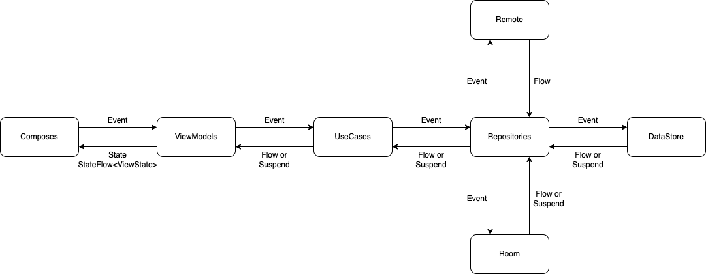
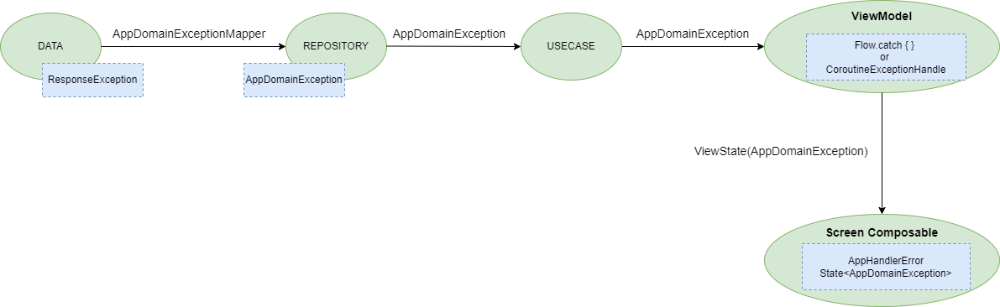
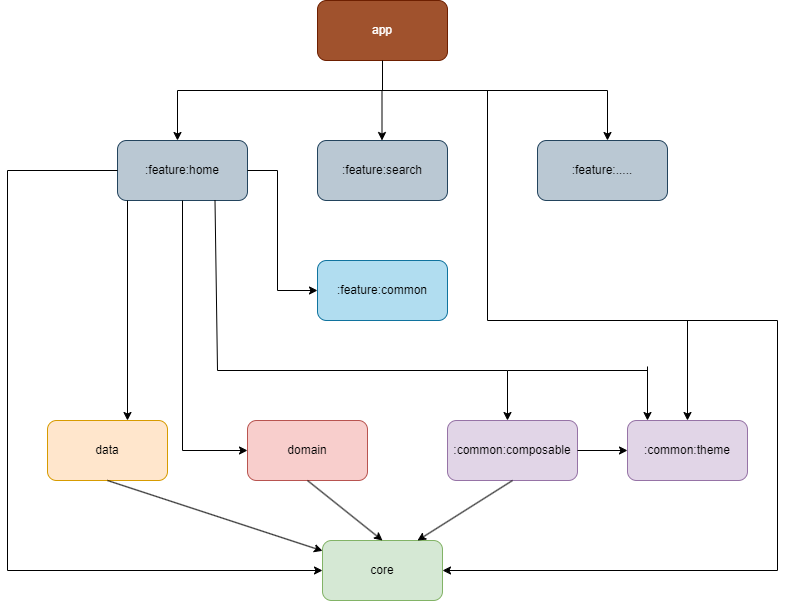

# qualgoo
Interview project

## :hammer: How to build app

- Recommended: Using the newest version of Android Studio Canary (JellyFish+).
- 1. You must add `google-services.json` inside `app/`
- 2. You must put maps value `API_KEY` into `AndroidManifests.xml` to build and run app
```XML
    <meta-data
            android:name="com.google.android.geo.API_KEY"
            android:value="${API_KEY}" />
```

## build with Bazel for speed up and manage code artifacts

`$ bazel build //app:example_app`

```console
❯ bazel build //app:example_app
INFO: Analyzed target //app:example_app (0 packages loaded, 0 targets configured).
INFO: Found 1 target...
Target //app:example_app up-to-date:
  bazel-bin/app/example_app_deploy.jar
  bazel-bin/app/example_app_unsigned.apk
  bazel-bin/app/example_app.apk
INFO: Elapsed time: 0.771s, Critical Path: 0.00s
INFO: 1 process: 1 internal.
INFO: Build completed successfully, 1 total action
```

## :blue_book: Features

- Show the current weather by location or address name.
- Search location by address name by using Google Places.
- Using Room database to manage(CRUD operations) result of search addresses (latlng, cities)
- Support light/dark mode.
- Support dynamic material from Android 13 and above.
- Support locales.

# Design Patterns
 
- MVVM
- Clean Architecture
- UDF (Unidirectional Data Flow)
- Dependence Injection, Singleton, Creational, Structural, Behavioral

## :construction: Tech-stack
- Jetpack Compose
- Material3
- Coroutine
- Retrofit + okhttp3
- Gson
- Room
- DataStore
- Accompanist
- Hilt
- Coil
- Multi Modules
- Kotlin DSL
- Android Architecture Components
- Google MapApi, PlayServices, Firebase

## :tram: Data flow

Application is supported by `Flow` and `Suspend` for data stream flow in app.




## :x: Error flow

In data module, when response returned error, we should transform the error to `ResponseException`. In domain and features module, we transform the error from `ResponseException` to `AppDomainException` to display error in to UI.



## Modularization
To achieve low coupling, high cohesion with maximum reusability & scalable code base, this project is modularized.
This app consist of following modules:

- app
- feature home
- feature search
- feature common
- data
- domain
- common composable
- common theme
- core

